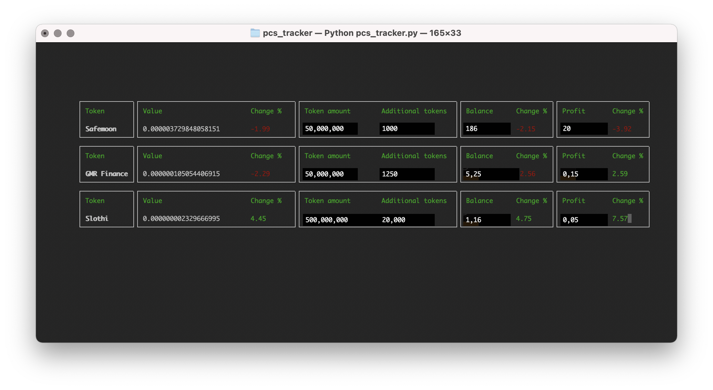

# Pancake Swap Crypto Terminal Tracker
This tracker is based on Python and should run on Linux, Windows and OSX (tested). It gives you useful information about your Tokens bought on Pancakeswap. For example:
- Actual value of the token (calculated directly over BSCScan)
- Amount of your tokens (gathered through your wallet information)
- Additional token count (will be added to the token amount as well) - for tokens which have the Tokenomics included
- Actual balance based on the price and the total amount of your tokens
- Profit of your investment
- Percentual changes based on the initial timestamp of the tracker start (will be saved in a sqlite database on your filesystem)



## Prerequisites
### API Key for BSCScan
You need an account for BSCScan to create an API key, needed for the tracker. You can create an account on https://bscscan.com \
After that you can create the API key in your profile section.
### API Key for Exchange Rates
For gathering the proper exchange rate an API key is needed. I use the free service from https://free.currencyconverterapi.com \
Just go to the link and enter your E-Mail. You should get an API-Key shortly.

## Installation
Python must be installed!

Download the ZIP File or \
```git clone https://github.com/TBMoonwalker/pcs_tracker.git```
### Required python packages
Install them with ```pip install```
- bscscan-python
- web3
- asyncio

## Configure
Copy the existing config-example.json to config.json and insert the relevant configuration. Any token which is listed on Pancakeswap should work just fine. The description, how to find the "Token pairs" and the decimal count of the token is described in this Reddit post: https://www.reddit.com/r/pancakeswap/comments/mwz72v/is_there_a_way_to_monitor_the_price_on_pancake/

Token requests can also be communicated through the Github issues.

## Run
```python3 pcs_tracker.py```
